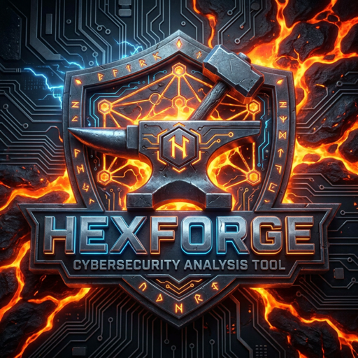

<div align="center">



# HexForge Security Lite

**Passive web security analysis. Low noise. Clear evidence. No drama.**

[](https://github.com/BP202302/hexforge-security-lite)
[](https://python.org)
[](LICENSE)
[](https://hexforge-security-lite.onrender.com)
[](#)
[](#multi-language-support)

-----

### 🌐 [Live Demo](https://hexforge-security-lite.onrender.com)  ·  [GitHub](https://github.com/BP202302/hexforge-security-lite)  ·  [Support the project ❤️](https://www.paypal.com/donate/?hosted_button_id=S3335NNBYZXES)

> ⚠️ Demo may take ~30 seconds to wake up on first visit (free tier). Worth the wait.

</div>

-----

## What is HexForge Security Lite?

HexForge Security Lite is a **passive web security scanner** built from scratch in pure Python — no frameworks, no pip dependencies, no bloat.

It was designed with one philosophy:

> **Fewer findings. Better signal. Clearer evidence.**

Most scanners throw 200 findings at you, 180 of which are noise. HexForge Lite gives you what actually matters, explained clearly, with confidence ratings and actionable recommendations.

It is **not** an offensive tool. It does not brute force, fuzz payloads, bypass authentication, or exploit anything. It reads. It observes. It reports.

-----

## Quick start

```bash
# 1. Clone
git clone https://github.com/BP202302/hexforge-security-lite
cd hexforge-security-lite

# 2. Run (no pip install needed)
python3 -B server.py

# 3. Open
# http://127.0.0.1:8000
```

That’s it. No virtual environments. No Docker. No config files. Just Python 3.

-----

## What it checks

HexForge Lite runs **17 passive modules** across two categories:

### 🔒 Security review

|Module              |What it checks                                              |
|--------------------|------------------------------------------------------------|
|`SecurityHeaders`   |Missing defensive headers (CSP, HSTS, X-Frame-Options, etc.)|
|`Clickjacking`      |Frame embedding protection                                  |
|`CorsPolicy`        |CORS misconfiguration and wildcard origin risks             |
|`CookieFlags`       |Secure, HttpOnly, SameSite attribute review                 |
|`TlsBasics`         |TLS version and certificate expiration                      |
|`CachePolicy`       |Sensitive content caching risks                             |
|`RedirectPolicy`    |Open redirect indicators                                    |
|`ContentType`       |MIME sniffing and content-type mismatch                     |
|`MetadataExposure`  |Server banners, generator tags, version leaks               |
|`CommentsExposure`  |Internal notes, debug comments in HTML                      |
|`EmailTokenExposure`|Emails, JWT fragments, tokens in visible HTML               |
|`ExternalResources` |Third-party scripts and style dependencies                  |
|`MixedContent`      |HTTP resources inside HTTPS pages                           |

### 🗺️ Surface mapping

|Module         |What it maps                                     |
|---------------|-------------------------------------------------|
|`ClientSurface`|Same-origin routes, API paths, JS bundle analysis|
|`FormsBasics`  |Form actions, methods, input field names         |
|`RobotsSitemap`|`robots.txt`, `sitemap.xml` disclosed paths      |
|`SecurityTxt`  |RFC 9116 disclosure contact discovery            |

-----

## How the pipeline works

```
URL input
   │
   ▼
Normalize & validate
   │
   ▼
Fetch safely (headers + HTML + TLS)
   │
   ▼
Run 17 passive modules in parallel
   │
   ▼
Validate findings (anti-noise layer)
   │
   ▼
Deduplicate overlapping results
   │
   ▼
Score conservatively by severity
   │
   ▼
Render report with evidence + confidence + recommendations
```

Each finding includes:

- **Severity** — Critical / High / Medium / Low / Informational
- **Confidence** — High / Medium / Low
- **Evidence** — exactly what was observed
- **Recommendation** — what to do about it
- **Precision note** — what Lite did NOT do (so you know the limits)

-----

## What makes it different

|                     |HexForge Lite         |Typical free scanners|
|---------------------|----------------------|---------------------|
|Dependencies         |**Zero**              |Many                 |
|False positive rate  |**Low by design**     |High                 |
|Finding explanations |**Clear + actionable**|Technical noise      |
|Surface mapping      |**Yes**               |Rarely               |
|Multilingual UI      |**7 languages**       |English only         |
|Anti-noise validators|**Yes**               |No                   |
|Setup time           |**< 30 seconds**      |Minutes to hours     |
|Offensive features   |**None (intentional)**|Often included       |

-----

## API usage

```bash
curl -X POST https://hexforge-security-lite.onrender.com/api/scan \
  -H "Content-Type: application/json" \
  -d '{"url":"https://example.com"}'
```

Or locally:

```bash
curl -X POST http://127.0.0.1:8000/api/scan \
  -H "Content-Type: application/json" \
  -d '{"url":"https://your-authorized-target.com"}'
```

Response includes: findings, severity summary, surface map, TLS info, version, and timestamp.

-----

## CLI usage

```bash
python3 -B cli/hexforge.py https://example.com
```

-----

## Self-check and tests

```bash
# Controlled local self-check (no network required)
python3 -B scripts/self_check.py

# Unit test suite
python3 -B -m unittest discover tests
```

Self-check runs 12 controlled lab profiles covering: header checks, CORS, cookies, TLS, forms, mixed content, JWT exposure, robots, client surface, and security.txt.

-----

## Multi-language support

The interface and finding labels are available in:

🇪🇸 Spanish   🇺🇸 English   🇧🇷 Portuguese   🇯🇵 Japanese   🇨🇳 Chinese   🇸🇦 Arabic   🇮🇳 Hindi

-----

## Project structure

```
hexforge-security-lite/
├── hexforge_lite/
│   ├── engine/         # Scanner orchestration
│   ├── modules/        # 17 passive analysis modules
│   ├── validators/     # Anti-noise and dedup layer
│   ├── scoring/        # Conservative risk scoring
│   └── output/         # Finding formatter
├── website/            # Web UI (HTML/CSS/JS)
├── api/                # API route handlers
├── cli/                # CLI entrypoint
├── tests/              # Unit tests
├── scripts/            # Self-check and runners
├── docs/               # Architecture and validation notes
├── benchmarks/         # DVWA and Juice Shop lab notes
├── datasets/           # Reference data (headers, CORS patterns)
└── rules/              # Rule definitions
```

-----

## Responsible use

HexForge Security Lite is for:

- ✅ Your own systems and apps
- ✅ Staging and lab environments
- ✅ Authorized security reviews
- ✅ Learning and defensive research
- ✅ Community improvement

**Do not use it against systems you do not own or have explicit written permission to test.**

-----

## Roadmap

|Edition    |Status     |Highlights                                                 |
|-----------|-----------|-----------------------------------------------------------|
|**Lite**   |✅ Available|17 modules, passive, open source, free                     |
|**Pro**    |🔜 Coming   |Multi-URL, AI analysis, PDF reports, advanced validation   |
|**Specter**|🔜 Coming   |Deep crawler, Nuclei integration, teams dashboard, full API|

-----

## Support the project

HexForge Security Lite is free and open source.

If it saves you time or helps you find something real, consider supporting development:

[](https://www.paypal.com/donate/?hosted_button_id=S3335NNBYZXES)

-----

## License and trademark

- See [`LICENSE`](LICENSE) for usage terms
- See [`TRADEMARKS.md`](TRADEMARKS.md) for brand and naming restrictions

The HexForge Security name, logo, and brand assets are reserved. Commercial use, rebranding, and SaaS resale require written permission from the author.

-----

<div align="center">

**© 2026 Brandon Steven Barrera Portillo · HexForge Security Lite · Non-commercial use**

[hexforgeai.dev](https://hexforgeai.dev/)  ·  [GitHub](https://github.com/BP202302/hexforge-security-lite)  ·  [Live Demo](https://hexforge-security-lite.onrender.com)

</div>

HexForge Security name, logo and branding remain protected project assets.
