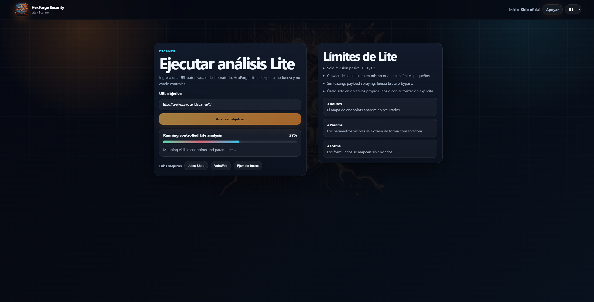
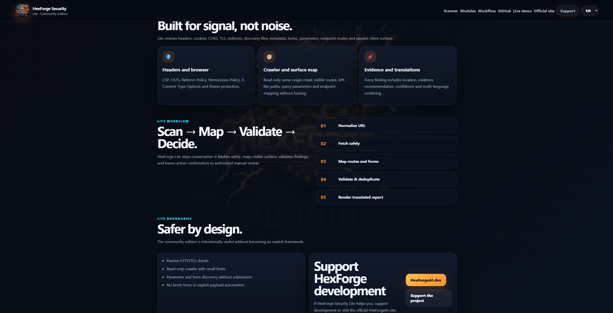
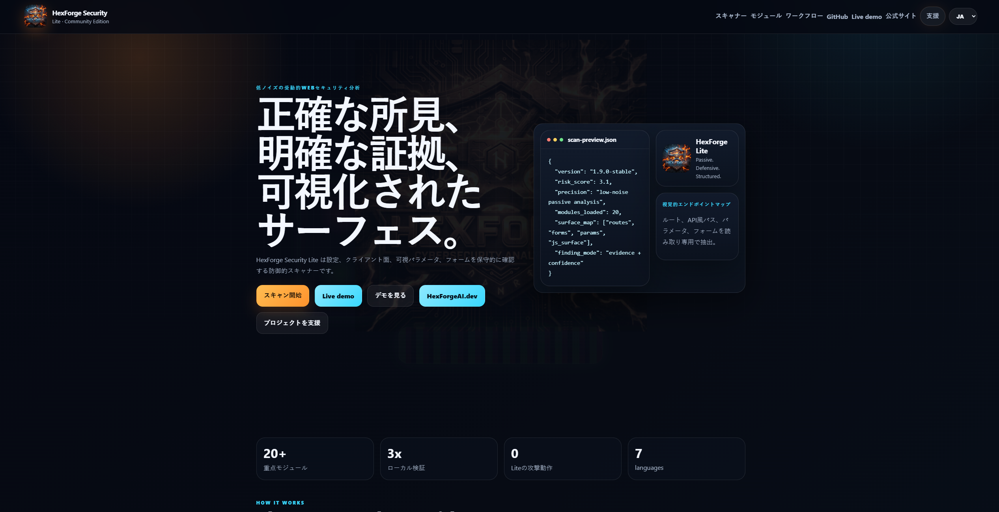

<div align="center">

# ⚔️ HexForge Security Lite

### Passive Web Security Analysis · Low Noise · Evidence First

<br>

<p>
  <a href="https://hexforge-security-lite.onrender.com">
    
  </a>
  <a href="https://hexforgeai.dev/">
    
  </a>
  <a href="https://www.paypal.com/donate/?hosted_button_id=S3335NNBYZXES">
    
  </a>
</p>

<p>
  
  
  
  
  
</p>

<br>

**HexForge Security Lite** is a source-available Lite edition for passive web security analysis.  
It transforms visible web signals into structured findings with evidence, confidence, severity and recommendations.

Built for clarity.  
Built for defensive review.  
Built for signal, not noise.

</div>

---

## 🧭 Navigation

| Section | Description |
|---|---|
| [Overview](#-overview) | What HexForge Lite is |
| [Live Demo](#-live-demo) | Hosted Render demo |
| [Screenshots](#-screenshots) | Place for visual proof |
| [Core Philosophy](#-core-philosophy) | Why this tool exists |
| [What It Checks](#-what-it-checks) | Detection areas |
| [How It Works](#-how-it-works) | Scanner workflow |
| [Report Format](#-report-format) | How findings are presented |
| [Architecture](#-architecture) | Project structure |
| [Quick Start](#-quick-start) | Run locally |
| [API](#-api) | API routes |
| [Safety Boundaries](#-safety-boundaries) | What Lite does and does not do |
| [Roadmap](#-roadmap) | Future direction |
| [Support](#-support-the-project) | Support development |

---

# 🛡️ Overview

**HexForge Security Lite** is a lightweight defensive scanner focused on passive web security review.

It helps identify visible security signals such as:

- missing browser hardening headers
- HTTPS and transport configuration gaps
- cookie attribute weaknesses
- permissive CORS behavior
- client-side API references
- visible routes
- forms
- parameters
- discovery files
- metadata exposure
- passive surface clues

The goal is not to overwhelm users with noise.  
The goal is to produce readable findings that explain what was observed and why it matters.

---

# 🚀 Live Demo

Try the hosted version:

<p align="center">
  <a href="https://hexforge-security-lite.onrender.com">
    
  </a>
</p>

Useful routes:

```text
/
 /scanner
 /results
 /health
 /api/meta
 /api/scan
```

Recommended safe test target:

```text
https://example.com
```

For security learning, use targets you own or intentionally vulnerable labs that you are authorized to test.

---

# 🖼️ Screenshots

<!-- Agregar fotos -->

Recommended screenshot files:

```text
screenshots/landing.png
screenshots/scanner.png
screenshots/report-overview.png
screenshots/evidence-recommendations.png
```

Suggested layout after uploading screenshots:

```markdown
<p align="center">
  
</p>

<p align="center">
  
</p>

<p align="center">
  
</p>
```

---

# 🧠 Core Philosophy

HexForge Lite is designed around one principle:

> Clear evidence is more useful than loud output.

## Signal over noise

Not every observation should become a panic alert.  
HexForge Lite focuses on practical signals that help the user review security posture.

## Evidence before hype

Every useful finding should answer:

| Question | Purpose |
|---|---|
| What was observed? | Shows the exact signal |
| Where was it found? | Gives location and context |
| Why does it matter? | Explains the security meaning |
| What should be reviewed? | Provides the next step |
| How confident is it? | Avoids overclaiming |

## Passive before aggressive

HexForge Lite is intentionally conservative.  
It performs safe, read-only analysis and avoids destructive behavior.

---

# 🔍 What It Checks

## Browser hardening headers

HexForge Lite reviews visible browser-facing headers such as:

- Content-Security-Policy
- Strict-Transport-Security
- Referrer-Policy
- Permissions-Policy
- X-Content-Type-Options
- frame and iframe protection indicators

## HTTP and HTTPS posture

The scanner observes:

- HTTP status
- HTTPS usage
- redirect behavior
- transport hints
- response metadata
- visible configuration gaps

## Cookies

HexForge Lite checks observable cookie attributes including:

- Secure
- HttpOnly
- SameSite
- cookie scope
- client-visible session posture

## CORS

The scanner can identify permissive CORS patterns and classify them as review-oriented findings when context is required.

## Client-side surface

HexForge Lite extracts visible client-side references such as:

- routes
- scripts
- API-like paths
- forms
- parameters
- linked resources
- same-origin references

## Forms and parameters

The scanner maps visible forms and parameters without submitting exploit payloads.

## Discovery files

Depending on the deployed version and modules, Lite may observe common discovery resources such as:

- robots.txt
- sitemap.xml
- security.txt
- visible metadata files

---

# 🧬 How It Works

```text
Target URL
   │
   ▼
Normalize URL
   │
   ▼
Safe HTTP Fetch
   │
   ▼
Passive HTML / Header / Surface Review
   │
   ▼
Detection Modules
   │
   ▼
Validation and Deduplication
   │
   ▼
Risk Scoring
   │
   ▼
Human-Readable Report
```

HexForge Lite does not try to prove exploitation automatically.  
It collects visible signals and presents them in a structured way for review.

---

# 📊 Report Format

A HexForge Lite finding can include:

| Field | Meaning |
|---|---|
| Severity | Critical, high, medium, low or informational |
| Confidence | How reliable the observation is |
| Location | Where the signal appeared |
| Evidence | What was actually observed |
| Recommendation | What should be reviewed or improved |
| Precision note | Why the finding should not be exaggerated |
| Rule ID | Internal reference for the finding |

Example:

```text
Finding: Missing browser hardening headers
Severity: Medium
Confidence: High
Location: HTTP response headers
Evidence: Missing Content-Security-Policy, Referrer-Policy, Permissions-Policy
Recommendation: Add browser hardening headers based on the needs of the application.
Precision: Confirmed from the HTTP response, but final impact depends on application behavior.
```

---

# 🧱 Architecture

HexForge Lite is organized as a modular Python project.

```text
hexforge-security-lite/
├── api/
│   ├── handlers
│   └── routes
│
├── assets/
│   └── branding and visual resources
│
├── benchmarks/
│   └── benchmark material
│
├── cli/
│   └── command line entrypoints
│
├── datasets/
│   └── controlled test and reference data
│
├── docs/
│   └── documentation
│
├── examples/
│   └── usage examples
│
├── frontend/
│   └── frontend resources
│
├── hexforge_lite/
│   ├── engine/
│   ├── modules/
│   ├── output/
│   ├── scoring/
│   ├── utils/
│   ├── validators/
│   ├── config.py
│   ├── fetcher.py
│   ├── models.py
│   └── plugins.py
│
├── lab/
│   └── lab resources
│
├── plugins/
│   └── external or experimental plugin resources
│
├── rules/
│   └── rule references
│
├── screenshots/
│   └── visual proof and README images
│
├── scripts/
│   └── automation and checks
│
├── tests/
│   └── test suite
│
├── website/
│   ├── index.html
│   ├── scanner.html
│   ├── results.html
│   ├── static.css
│   └── i18n.js
│
├── Dockerfile
├── README.md
├── requirements.txt
├── run.sh
└── server.py
```

---

# ⚙️ Quick Start

## Run locally

```bash
git clone https://github.com/BP202302/hexforge-security-lite.git
cd hexforge-security-lite
pip install -r requirements.txt
python3 server.py
```

Open:

```text
http://127.0.0.1:10000
```

If a different port is configured, use the port shown in your terminal.

---

## Run with shell script

```bash
chmod +x run.sh
./run.sh
```

---

## Run with Docker

```bash
docker build -t hexforge-security-lite .
docker run -p 10000:10000 hexforge-security-lite
```

Open:

```text
http://127.0.0.1:10000
```

---

# 🌐 API

## Health check

```http
GET /health
```

## Metadata

```http
GET /api/meta
```

## Scan target

```http
POST /api/scan
Content-Type: application/json
```

Example request:

```json
{
  "target": "https://example.com"
}
```

Example response shape:

```json
{
  "ok": true,
  "version": "1.9.0-stable",
  "target": "https://example.com",
  "findings": [],
  "risk_score": 0
}
```

---

# 🧪 Testing

Run the test suite:

```bash
python3 -B -m unittest discover tests
```

Run self-checks if available:

```bash
python3 -B scripts/self_check.py
```

Recommended before a release:

```bash
python3 -B -m unittest discover tests
python3 -B scripts/self_check.py
```

---

# 🧩 Lite Modules

HexForge Lite can include passive modules for:

| Module Area | Purpose |
|---|---|
| Headers | Browser and HTTP header review |
| TLS / HTTPS | Transport posture observations |
| Cookies | Cookie attribute inspection |
| CORS | Cross-origin policy review |
| Discovery | Visible metadata and discovery files |
| Forms | Passive form mapping |
| Parameters | Query and client-side parameter detection |
| Routes | Visible path extraction |
| API-like references | Client-side endpoint discovery |
| Comments | Passive review of visible HTML comments |
| Metadata | HTML and response metadata review |
| Report output | Structured result rendering |

---

# 🧠 Result Interpretation

HexForge Lite findings are review guidance, not automatic proof of exploitability.

A missing header may be important.  
A permissive CORS policy may require more context.  
A visible route may be normal or sensitive depending on the application.  
A client-side endpoint may be expected, internal, deprecated or worth reviewing.

The scanner provides the signal.  
The reviewer decides the final impact.

---

# 🔒 Safety Boundaries

HexForge Security Lite is intentionally limited.

## Lite does

- passive fetching
- header analysis
- TLS and HTTP observation
- form discovery
- route discovery
- parameter discovery
- client-side reference mapping
- conservative findings
- readable recommendations

## Lite does not

- brute force
- credential attacks
- destructive exploitation
- unauthorized bypass attempts
- heavy fuzzing
- exploit chaining
- payload automation against third-party targets
- intrusive vulnerability exploitation

Use only on systems you own, manage, or have explicit permission to review.

---

# 🧭 Use Cases

## Developer review

Check whether a web app exposes visible configuration weaknesses before publishing.

## Security learning

Understand common web security signals through readable evidence.

## Lab analysis

Use with intentionally vulnerable or controlled targets.

## Portfolio project

Show a real security tool with UI, API, reports and deployable architecture.

## Blue team visibility

Perform quick passive review of visible posture and browser-facing configuration.

## Pre-audit preparation

Collect visible findings before deeper manual validation.

---

# 🏗️ Product Positioning

HexForge Lite is the public Lite edition of the HexForge ecosystem.

| Edition | Purpose |
|---|---|
| Lite | Public source-available defensive scanner |
| Pro | Future advanced individual workflow |
| Specter | Future premium or enterprise direction |

The Lite repository should remain:

```text
Clean.
Safe.
Readable.
Public-facing.
Useful.
Non-destructive.
```

---

# 🗺️ Roadmap

| Version | Focus |
|---|---|
| v1.9.x | Stabilization, cleanup, documentation and demo polish |
| v2.x | Better reports, stronger module organization and improved CLI |
| v3.x | Visual mapping, richer exports and deeper workflow support |
| Pro track | Separate private or commercial direction |
| Specter track | Premium or enterprise direction |

---

# 🧾 Release Checklist

Before publishing a new version:

```text
Run tests
Run self-check
Confirm Render deploy
Confirm /scanner works
Confirm /results works
Confirm README version
Confirm CHANGELOG
Create tag
Create release ZIP
```

Suggested release names:

```text
v1.9.0-stable
v1.9.1-clean
v1.9.2-stable
v2.0.0-lite
```

---

# 💎 Why This Project Matters

Security tools should not only find things.  
They should explain them.

HexForge Lite exists because useful security review needs:

- clear findings
- visible evidence
- safe workflows
- practical recommendations
- controlled scope
- honest severity
- readable reports

The goal is not to generate fear.  
The goal is to generate understanding.

---

# 🤝 Contributing

Good contribution areas:

- passive modules
- report readability
- translations
- UI polish
- test cases
- documentation
- safer validation logic
- performance improvements
- false positive reduction

Contributions should preserve the Lite philosophy:

```text
Safe.
Passive.
Readable.
Evidence-first.
Low-noise.
```

---

# 💰 Support the Project

If HexForge Security Lite helps you, you can support development here:

<p align="center">
  <a href="https://www.paypal.com/donate/?hosted_button_id=S3335NNBYZXES">
    
  </a>
</p>

Official site:

<p align="center">
  <a href="https://hexforgeai.dev/">
    
  </a>
</p>

---

# ⚖️ Responsible Use

HexForge Security Lite is intended for educational, defensive and authorized security review.

Do not use this tool against systems without permission.

You are responsible for your own usage.

---

# 📄 License and Usage

HexForge Security Lite is a source-available Lite edition.

Review the repository license before using, modifying, redistributing or deploying this software.

Commercial use may require explicit permission depending on the license terms.

---

<div align="center">

## HexForge Security Lite

### Built for signal. Designed for clarity. Limited for safety.

<p>
  <a href="https://hexforge-security-lite.onrender.com">
    
  </a>
  <a href="https://hexforgeai.dev/">
    
  </a>
</p>

</div>
